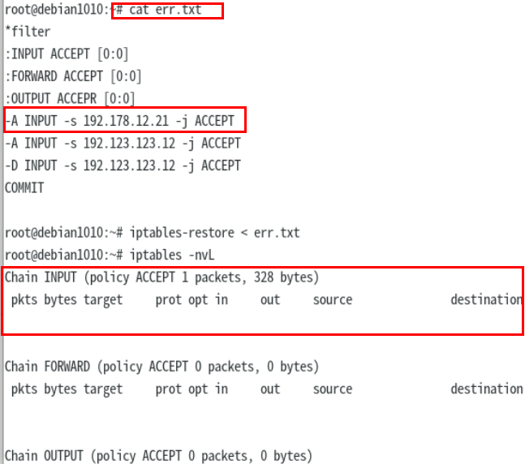
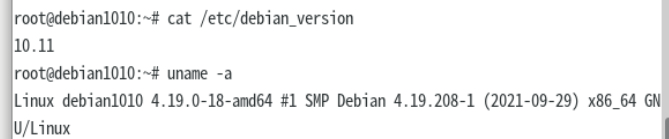

### debian10 iptables-restore 的 bug

系统是在官网下载的包安装的虚拟机

再一次业务对接过程中意外发现业务连不上这台机器， 经过排除大法，终于发现此 debian10 机器的 iptables-restore 模块存在问题 在 debian9 的系统上测试无此问题。 在网上也没有找到相关的记录 本来想提交给 debian 官网，奈何没有找到入口，遂在此记录。

当使用 iptables-restore 恢复防火墙时，会清除 -D 规则之前的所有防火墙条目

问题图，-D前的规则被删除

系统配置图

在社区以及官网找了很久都没有找到相关说明 先记录一下
