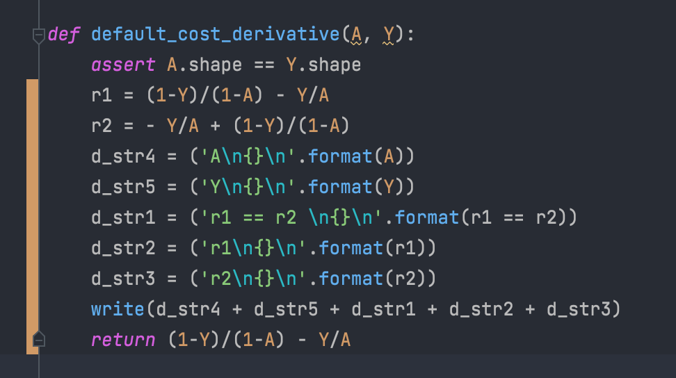
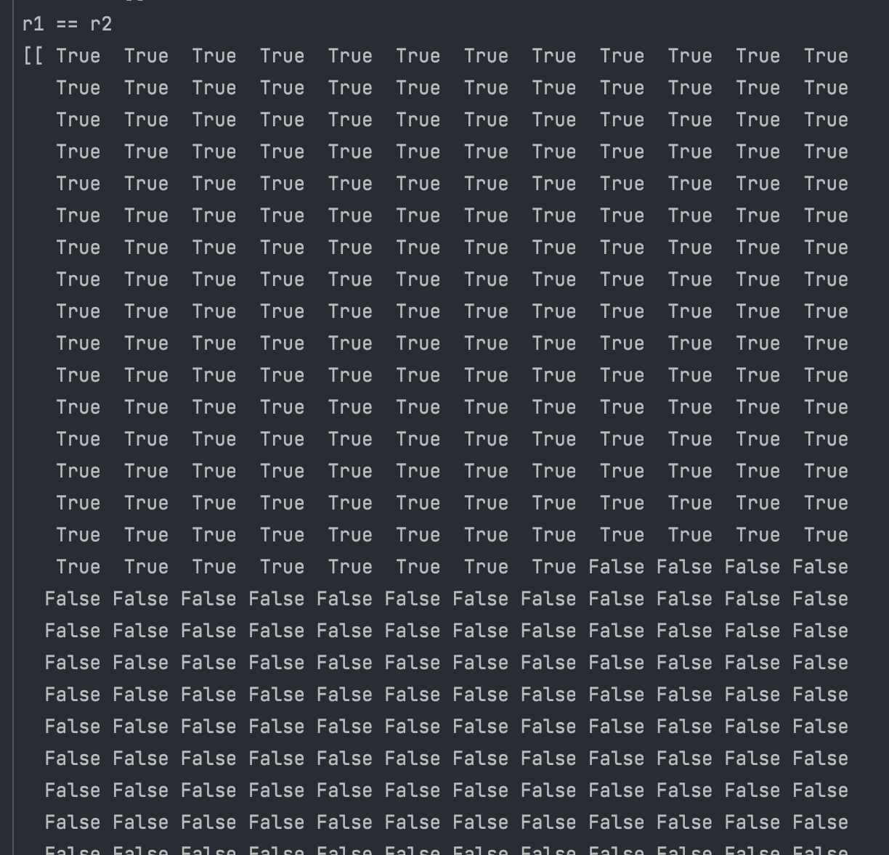
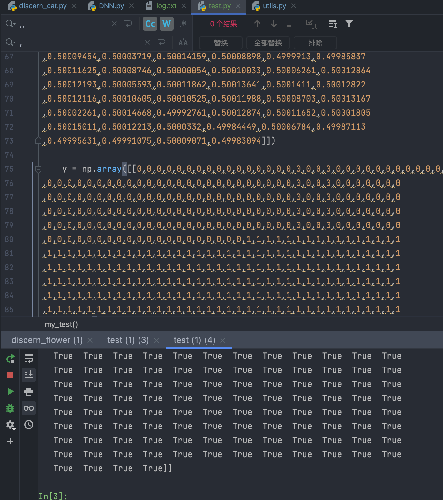

## 一次重构自己的一个DNN模型发现的问题

### 交叉墒损失函数引起的bug

重构的时候发现一个bug

感觉是python底层解析执行的问题，向量化计算会失败, 出bug代码 

向量化的计算结果与实际不一致

bug示例，部分截图 

有意思的是，专门写了一个测试把原有数据拿去测试，居然复现不出 

排查到凌晨，发现是这个问题。。。具体原因还没找到，只找到bug点。

先记录一下，以后再研究

